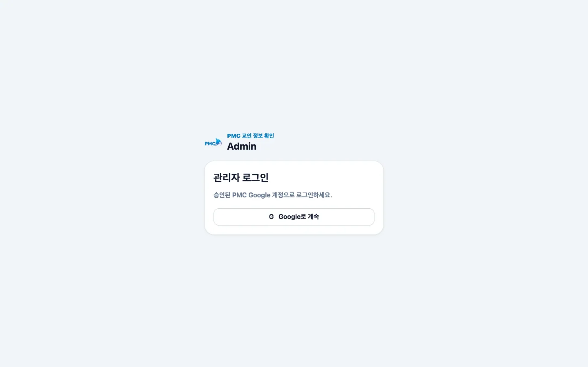
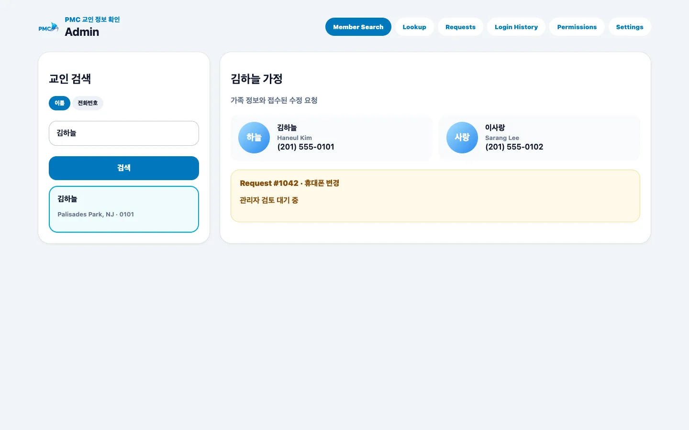

# 관리자 로그인 및 교인 검색

## 목적

승인된 Google 관리자 계정으로 로그인해 이름 또는 전화번호로 가족 정보를 찾습니다.

## 사전 조건

- Super Admin 또는 Pastor로 승인된 Google 계정이 필요합니다.

## 작업 단계

1. 관리자 로그인에서 **Google로 계속**을 선택하고 승인 계정을 사용합니다.
2. **Member Search**에서 **이름** 또는 **전화번호** 검색 방식을 고릅니다.
3. 검색어를 입력하고 결과 후보의 도시·번호 끝자리를 대조합니다.
4. 올바른 후보를 선택해 가족 정보와 수정 요청을 확인합니다.

<figure class="desktop-shot"><figcaption>1단계: 승인된 Google 관리자 계정으로 로그인</figcaption></figure>
<figure class="desktop-shot"><figcaption>2–4단계: 이름·전화 검색 후 가족과 요청 확인</figcaption></figure>

## 성공 결과

선택한 교인의 가족 카드와 관련 요청이 오른쪽에 표시됩니다.

## 흔한 오류와 해결

- **접근 거부**: 개인 Google 계정 대신 승인된 계정인지 확인합니다.
- **동명이인**: 도시, 가족 구성원, 전화 끝자리를 모두 대조합니다.
- **메뉴가 없음**: Lookup Admin에는 Member Search가 제공되지 않습니다.
