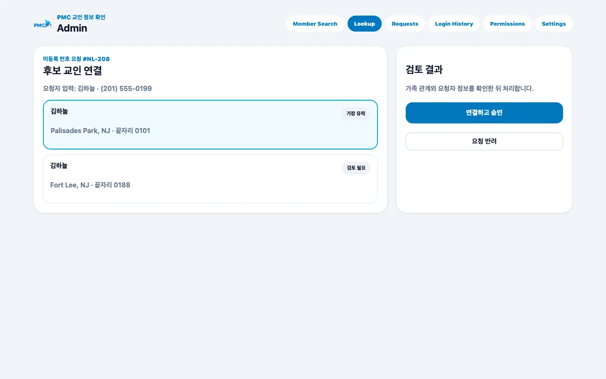

# 미등록 번호 검토

## 목적

로그인 시 등록되지 않은 번호로 접수된 요청을 교적 후보에 연결하고 승인 또는 반려합니다.

## 사전 조건

- Super Admin 또는 Lookup Admin 권한이 필요합니다.
- 요청자 입력만으로 확정하지 말고 교적 정보와 대조합니다.

## 작업 단계

1. **Lookup**에서 대기 요청을 열고 입력 이름·전화번호·진행 상태를 확인합니다.
2. 후보 목록의 지역, 전화 끝자리, 가족 관계를 대조합니다.
3. 확실한 후보를 선택하고 **연결하고 승인**을 선택합니다.
4. 일치 후보가 없거나 확인할 수 없으면 사유를 기록하고 **요청 반려**를 선택합니다.

<figure class="desktop-shot"><figcaption>1–4단계: 후보를 비교하고 승인 또는 반려</figcaption></figure>

## 성공 결과

승인된 요청은 올바른 교적에 연결되고, 반려된 요청에는 처리 사유가 남습니다.

## 흔한 오류와 해결

- **후보가 여러 명**: 추측하지 말고 추가 확인 후 처리합니다.
- **이미 처리됨**: 다른 관리자가 먼저 처리했는지 최신 상태를 새로 고칩니다.
