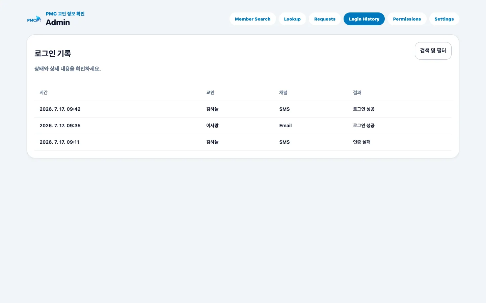
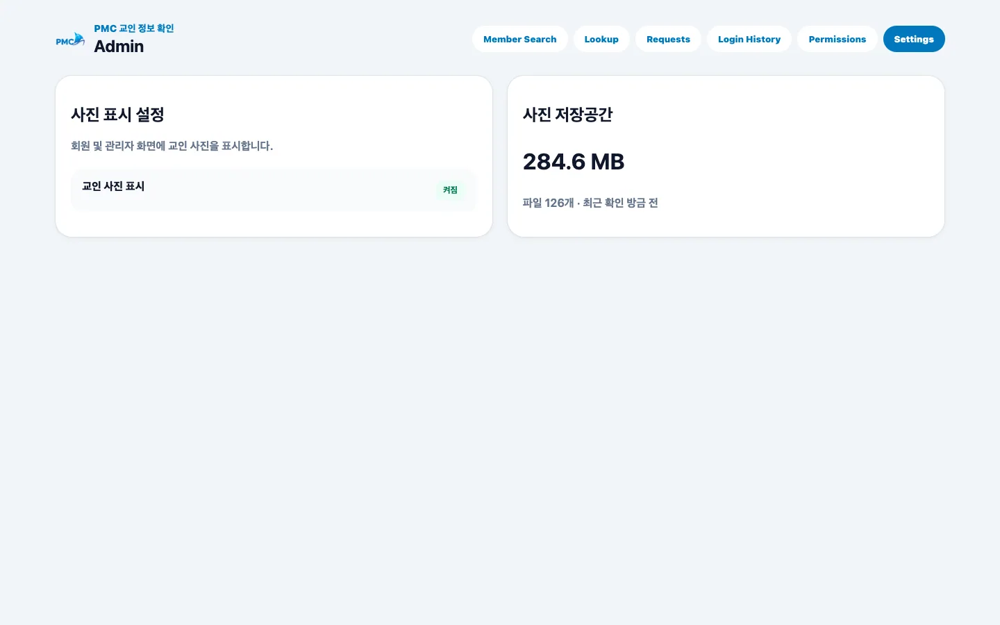
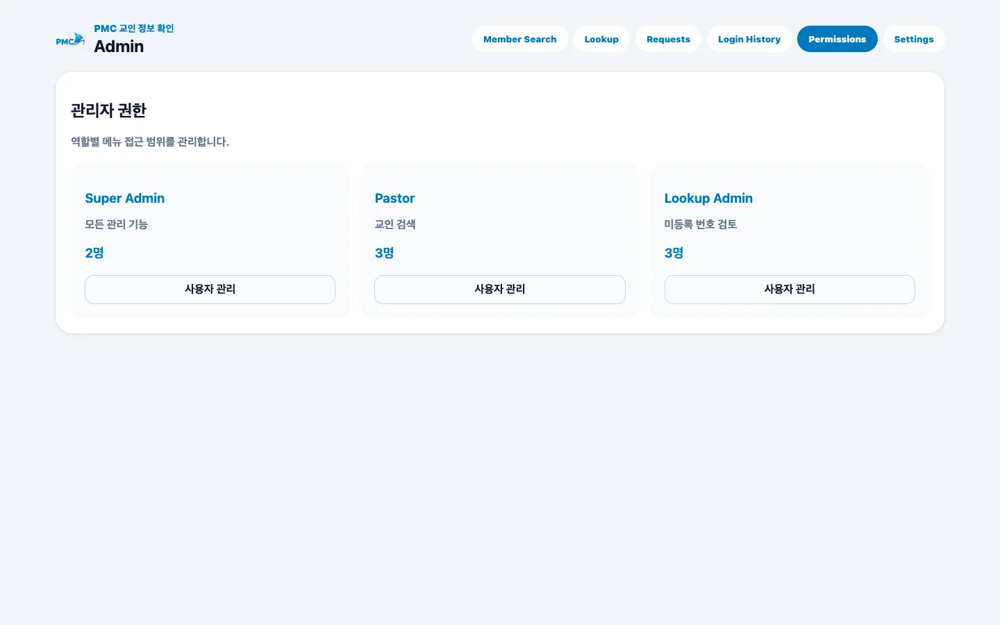

# 로그인 기록·설정·권한

## 목적

로그인 이력을 확인하고 사진 표시·저장공간 설정과 관리자 역할을 관리합니다.

## 사전 조건

- 이 기능은 Super Admin 전용입니다.

## 작업 단계

1. **Login History**에서 시간, 교인, SMS/Email 채널, 성공·실패 사유를 확인합니다.
2. **Settings**에서 교인 사진 표시 여부와 저장공간 사용량을 확인합니다.
3. **Permissions**에서 사용자를 Super Admin, Pastor, Lookup Admin 역할에 추가하거나 제거합니다.
4. 변경 후 대상 계정이 필요한 메뉴만 볼 수 있는지 확인합니다.

<figure class="desktop-shot"><figcaption>1단계: 로그인 기록과 실패 사유 확인</figcaption></figure>
<figure class="desktop-shot"><figcaption>2단계: 사진 표시와 저장공간 확인</figcaption></figure>
<figure class="desktop-shot"><figcaption>3–4단계: 역할별 사용자와 접근 범위 관리</figcaption></figure>

## 성공 결과

설정이 저장되고 각 역할은 [역할별 접근 권한](../access.md)에 정의된 메뉴만 봅니다.

## 흔한 오류와 해결

- **자신의 마지막 Super Admin 권한 제거**: 다른 Super Admin을 먼저 확인합니다.
- **저장공간을 읽을 수 없음**: 잠시 후 다시 시도하고 계속되면 지원팀에 문의합니다.
