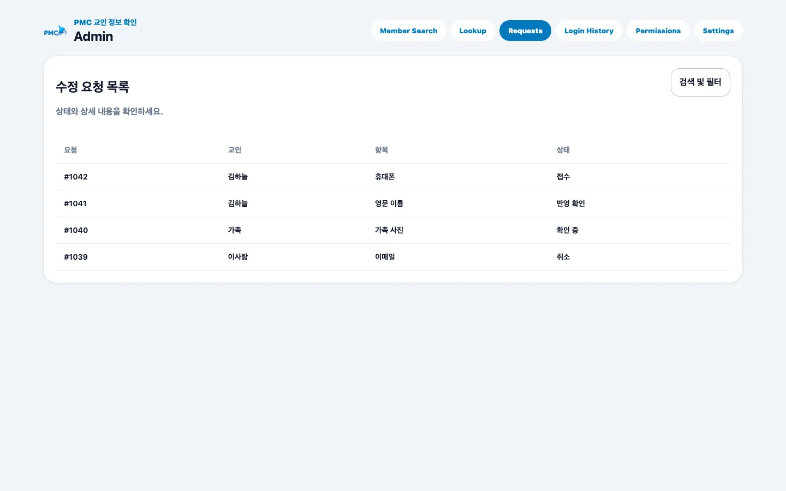

# 요청 처리

## 목적

전체 수정 요청 목록과 상세를 검토하고 상태 및 처리 메모를 정확히 갱신합니다.

## 사전 조건

- Super Admin 권한이 필요합니다.
- 교적 시스템에서 실제 반영 여부를 확인할 수 있어야 합니다.

## 작업 단계

1. **Requests**에서 상태·항목으로 필터하고 요청을 선택합니다.
2. 요청자, 대상 구성원, 변경 전·후 값, 사진과 인증 상태를 대조합니다.
3. 검토 시작 시 **확인 중**, 교적 입력 후 **입력 완료**로 갱신합니다.
4. 실제 반영을 확인하면 **반영 확인**, 처리할 수 없으면 사유와 함께 **반려**합니다.

<figure class="desktop-shot"><figcaption>1–4단계: 요청 목록을 필터하고 처리 상태를 관리</figcaption></figure>

## 성공 결과

회원 요청 상세에 최신 상태, 담당 역할, 처리 메모가 표시됩니다.

## 흔한 오류와 해결

- **인증 미완료**: 휴대폰·이메일 요청은 인증 상태를 먼저 확인합니다.
- **사진 비교 불가**: 원본을 내려받아 개인 장치에 보관하지 말고 승인된 화면에서 검토합니다.
