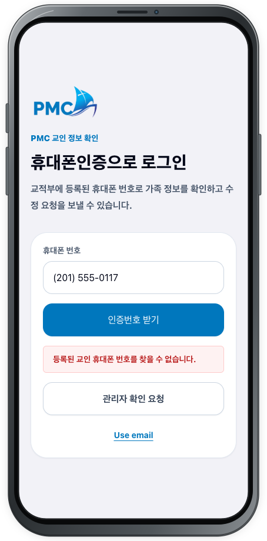
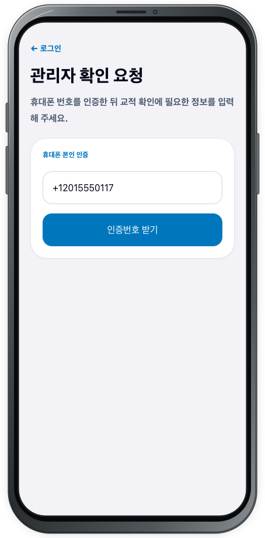
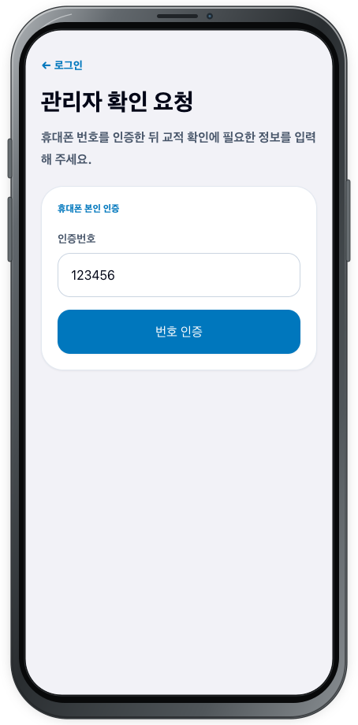
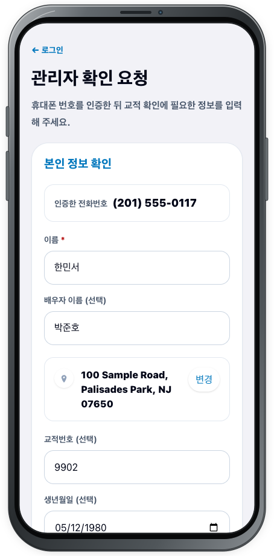
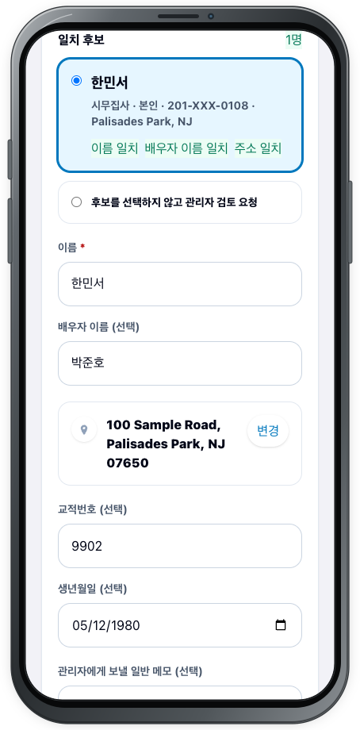
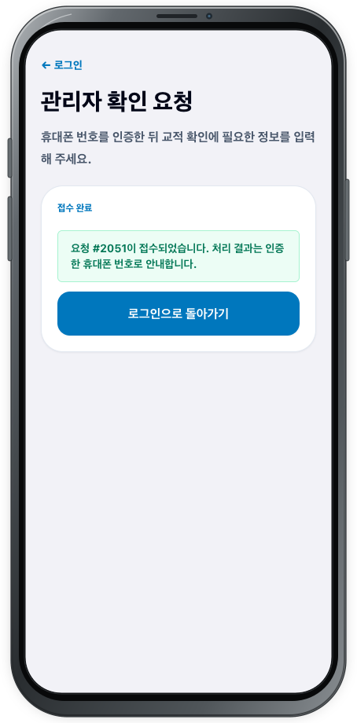

# 관리자 확인요청

## 목적

로그인 화면에서 등록된 휴대폰 번호를 찾을 수 없을 때 번호와 본인 정보를 확인해 관리자 검토 요청을 제출합니다.

## 사전 조건

- SMS를 받을 수 있는 본인 휴대폰이 필요합니다.
- 이름과 주소는 필수이며, 배우자 이름·교적번호·생년월일은 알고 있는 경우 준비합니다.

## 작업 단계

1. 회원 로그인에서 **등록된 교인 휴대폰 번호를 찾을 수 없습니다.**가 표시되면 **관리자 확인 요청**을 선택합니다.

<figure class="device-shot">
  
  <figcaption>미등록 번호 안내 아래의 <strong>관리자 확인 요청</strong>을 선택합니다.</figcaption>
</figure>

2. **관리자 확인 요청** 화면의 **휴대폰 본인 인증**에서 번호를 확인하거나 입력하고 **인증번호 받기**를 선택합니다.

<figure class="device-shot">
  
  <figcaption>연락받을 휴대폰 번호로 <strong>인증번호 받기</strong>를 선택합니다.</figcaption>
</figure>

3. SMS로 받은 번호를 **인증번호**에 입력하고 **번호 인증**을 선택합니다.

<figure class="device-shot">
  
  <figcaption>SMS 인증번호를 입력하고 <strong>번호 인증</strong>을 선택합니다.</figcaption>
</figure>

4. **본인 정보 확인**에서 **인증한 전화번호**가 맞는지 확인합니다.
5. **이름**과 **주소**를 입력합니다. 주소 자동 검색을 사용할 수 있으면 정확한 제안을 선택해 주소를 고정하고, 바꾸려면 **변경**을 선택합니다. 자동 검색을 사용할 수 없으면 전체 주소와 ZIP을 직접 입력합니다.
6. 알고 있는 경우 **배우자 이름 (선택)**, **교적번호 (선택)**, **생년월일 (선택)**을 입력합니다. 필요한 설명은 **관리자에게 보낼 일반 메모 (선택)**에 적습니다.

<figure class="device-shot">
  
  <figcaption>필수 정보와 알고 있는 선택 정보를 입력하고 주소를 확인합니다.</figcaption>
</figure>

7. 입력 내용과 일치하는 **일치 후보**가 나타나면 본인이라고 판단되는 후보를 선택합니다. 맞는 후보가 없으면 **후보를 선택하지 않고 관리자 검토 요청**을 선택할 수 있습니다.

<figure class="device-shot">
  
  <figcaption>본인 후보를 선택하거나 후보 없이 관리자 검토를 요청합니다.</figcaption>
</figure>

8. **관리자 검토 요청 제출**을 선택합니다.
9. **요청 #번호이 접수되었습니다. 처리 결과는 인증한 휴대폰 번호로 안내합니다.**를 확인하고 요청 번호를 메모합니다.

<figure class="device-shot">
  
  <figcaption>접수된 요청 번호와 SMS 결과 안내를 확인합니다.</figcaption>
</figure>

## 성공 결과

관리자 확인 요청 번호가 발급되고, 처리 결과를 받을 휴대폰이 안내됩니다.

## 다음 단계

인증한 휴대폰으로 오는 처리 결과 SMS를 기다립니다. 승인 안내를 받으면 [회원 로그인](login.md)으로 돌아가 다시 로그인합니다. 진행이 멈추면 요청 번호와 함께 [지원 요청](../support.md)을 이용하세요.
