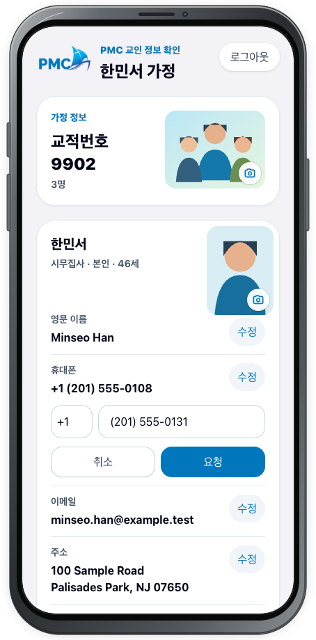
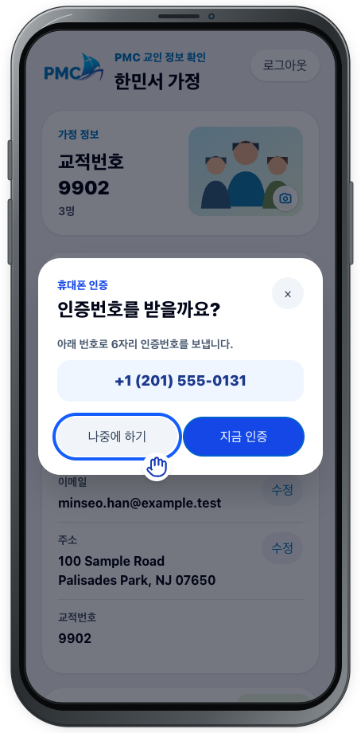
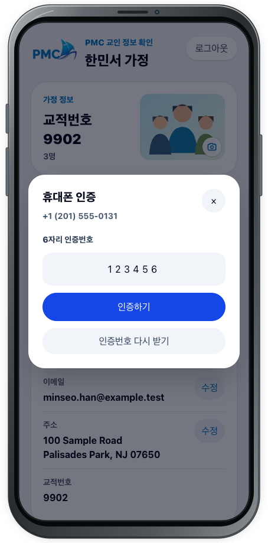
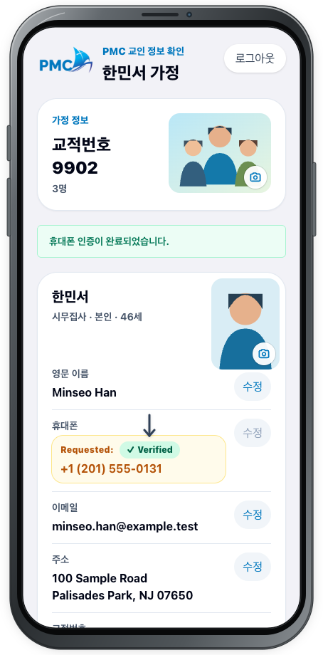

# 정보 수정 및 인증

## 목적

새 휴대폰 번호로 변경 요청을 만들고, 그 번호로 받은 인증번호를 즉시 확인해 요청을 인증 완료 상태로 만듭니다.

## 사전 조건

- [가족 정보](family.md)에 로그인되어 있어야 합니다.
- 변경할 새 휴대폰으로 SMS를 받을 수 있어야 합니다.

## 작업 단계

1. 변경할 구성원의 **휴대폰** 행에서 **수정**을 선택합니다.
2. 국가번호와 새 휴대폰 번호를 입력한 뒤 **요청**을 선택합니다. **취소**를 선택하면 입력을 닫고 현재 값으로 돌아갑니다.

3. **인증번호를 받을까요?** 창에서 표시된 새 번호가 맞는지 확인하고 **지금 인증**을 선택합니다.

4. **휴대폰 인증** 창에서 새 번호로 받은 **6자리 인증번호**를 입력하고 **인증하기**를 선택합니다.

5. 화면 위의 **휴대폰 인증이 완료되었습니다.** 안내를 확인합니다. 휴대폰 행에는 `Requested:`와 `Verified` 배지, 요청한 새 번호가 표시됩니다.
6. **요청 내역**에서 같은 요청의 `Request #요청번호`, `담당: 교적 관리자`, 변경 전·후 번호와 `Verified`를 확인합니다.

<figure class="device-shot">
  
  <figcaption>새 휴대폰 번호를 입력하고 <strong>요청</strong>을 선택합니다.</figcaption>
</figure>
<figure class="device-shot">
  
  <figcaption>번호를 확인한 뒤 <strong>지금 인증</strong>을 선택합니다.</figcaption>
</figure>
<figure class="device-shot">
  
  <figcaption>SMS로 받은 6자리를 입력하고 <strong>인증하기</strong>를 선택합니다.</figcaption>
</figure>
<figure class="device-shot">
  
  <figcaption><strong>휴대폰 인증이 완료되었습니다.</strong>와 <strong>Verified</strong>를 확인합니다.</figcaption>
</figure>

## 성공 결과

새 번호 변경 요청이 **접수**되고 휴대폰 인증은 `Verified`로 표시됩니다. `Verified`는 번호 인증 완료를 뜻하며, 교적 반영이 끝났다는 뜻은 아닙니다.

## 다음 단계

[요청 관리](requests.md)에서 담당 역할과 처리 상태를 확인합니다. 인증이나 제출에 문제가 있으면 [문제 해결](../troubleshooting.md)을 확인하세요.
