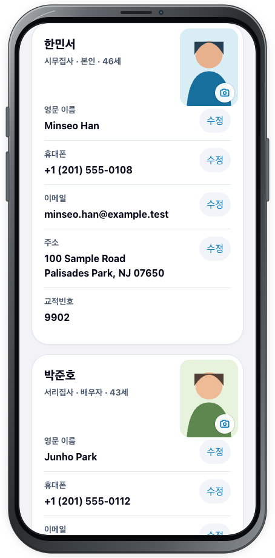

# 가족 정보

## 목적

가정 요약부터 각 구성원의 연락처와 사진까지 화면에 표시된 순서대로 확인합니다.

## 사전 조건

- [회원 로그인](login.md)을 완료해야 합니다.
- 다른 사람과 함께 쓰는 기기라면 화면을 떠날 때 **로그아웃**하세요.

## 작업 단계

1. 상단에서 가정 이름을 확인합니다.
2. **가정 정보** 카드에서 **교적번호**, 가족 구성원 수, 가족 대표 사진을 확인합니다. 가족 사진의 카메라 버튼은 사진 변경 요청을 시작하는 기능입니다.

3. 아래로 이동해 구성원 카드를 차례로 확인합니다. 각 카드에는 이름, 직분, 가족 관계, 나이와 개인 사진이 먼저 표시됩니다.
4. 이어서 **영문 이름**, **휴대폰**, **이메일**, **주소**, **교적번호**를 순서대로 확인합니다. 값이 없는 항목은 `-`로 표시될 수 있습니다.
5. 변경할 수 있는 항목 옆에는 **수정** 버튼이 있습니다. 개인 사진의 카메라 버튼은 해당 구성원의 사진 요청을 시작합니다.

<figure class="device-shot">
  
  <figcaption>가정 이름과 <strong>교적번호</strong>, 구성원 수, 가족 대표 사진을 먼저 확인합니다.</figcaption>
</figure>
<figure class="device-shot">
  
  <figcaption>구성원별 사진과 연락처를 확인하고 필요한 항목의 <strong>수정</strong>을 선택합니다.</figcaption>
</figure>

## 성공 결과

본인의 가정 요약과 각 가족 구성원의 정보가 올바른 순서와 대상에 맞게 표시됩니다.

## 다음 단계

휴대폰을 바꾸려면 [정보 수정 및 인증](edit.md), 가족 사진을 바꾸려면 [사진 요청](photos.md)으로 계속합니다. 다른 가족이 보이거나 정보가 누락되었다면 수정하지 말고 [문제 해결](../troubleshooting.md)을 확인하세요.
