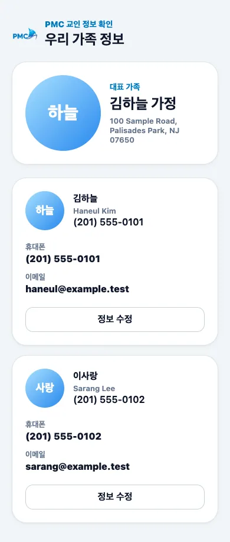
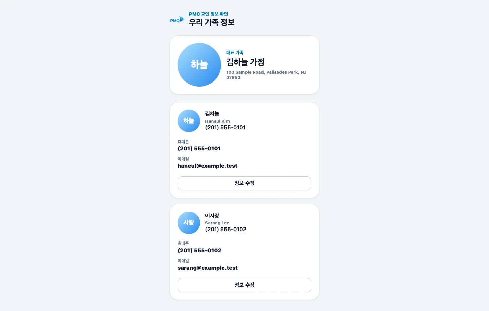

# 가족 정보

## 목적

가족 구성원별 이름, 연락처, 주소와 개인·가족 사진을 확인합니다.

## 사전 조건

- [회원 로그인](login.md)을 완료해야 합니다.

## 작업 단계

1. 상단의 가정 이름과 주소를 확인합니다.
2. 아래로 이동하며 가족 구성원과 개인 사진을 확인합니다.
3. 사진을 선택하면 크게 보고, 닫기 버튼으로 돌아옵니다.
4. 수정이 필요하면 해당 구성원의 **정보 수정**을 선택합니다.

<figure class="mobile-shot">
  
  <figcaption>1–4단계: 가족 대표와 구성원 정보를 확인하는 모바일 화면</figcaption>
</figure>

<figure class="desktop-shot">
  
  <figcaption>반응형 확인: 데스크톱에서도 같은 정보가 중앙 열에 표시됩니다.</figcaption>
</figure>

## 성공 결과

본인 가족의 정보만 표시되고 각 수정 버튼이 올바른 구성원에 연결됩니다.

## 흔한 오류와 해결

- **가족이 누락됨/다른 가족이 보임**: 수정 요청을 보내지 말고 즉시 로그아웃한 뒤 지원팀에 알립니다.
- **사진이 보이지 않음**: 관리자의 사진 표시 설정 또는 브라우저 네트워크를 확인합니다.
