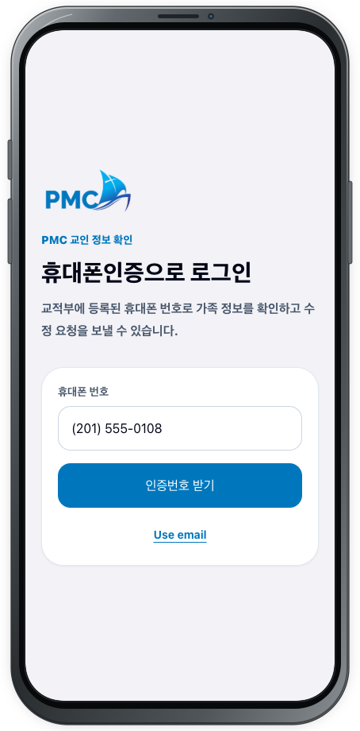
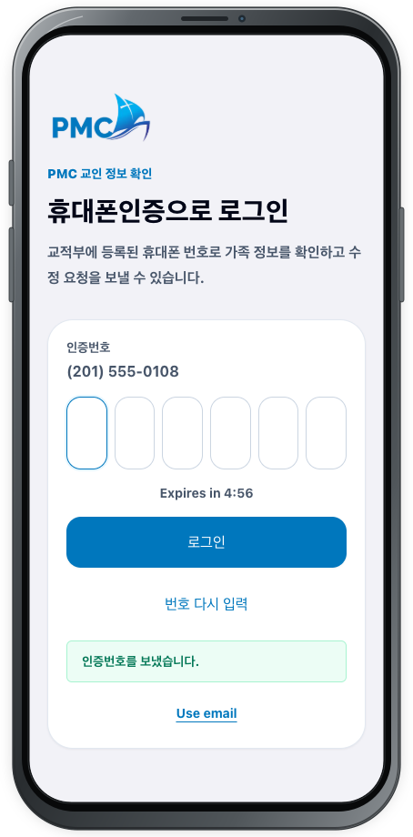

# 회원 로그인

## 목적

교적에 등록된 휴대폰 번호로 본인을 인증하고 가족 정보 화면을 엽니다.

## 사전 조건

- 교적에 등록된 휴대폰으로 SMS를 받을 수 있어야 합니다.
- 받은 6자리 인증번호를 다른 사람에게 알려주지 마세요.

## 작업 단계

1. **휴대폰인증으로 로그인** 화면의 **휴대폰 번호**에 본인의 번호를 입력합니다.
2. 버튼이 활성화되면 **인증번호 받기**를 선택합니다.

3. **인증번호를 보냈습니다.** 안내가 나타나면 SMS로 받은 6자리 번호를 **인증번호** 여섯 칸에 입력합니다.
4. 남은 시간을 확인하고 **로그인**을 선택합니다. 번호를 잘못 입력했다면 **번호 다시 입력**으로 돌아갈 수 있습니다.

등록 이메일을 사용하려면 화면 아래의 **Use email**을 선택할 수 있습니다. 이메일 로그인도 **인증번호 받기** 후 6자리 번호로 로그인하는 방식입니다.

<figure class="device-shot">
  
  <figcaption>휴대폰 번호를 입력하고 <strong>인증번호 받기</strong>를 선택합니다.</figcaption>
</figure>
<figure class="device-shot">
  
  <figcaption>전송 안내를 확인한 뒤 6자리 인증번호를 입력하고 <strong>로그인</strong>합니다.</figcaption>
</figure>

## 성공 결과

로그인이 완료되고 본인의 가정 이름과 가족 정보가 표시됩니다.

## 다음 단계

[가족 정보 확인](family.md)으로 계속합니다. 등록된 번호를 찾을 수 없다는 안내가 나오면 로그인 화면의 **관리자 확인 요청**을 선택하고 [관리자 확인요청](admin-confirmation.md)을 따르세요. 인증번호 문제는 [문제 해결](../troubleshooting.md)을 확인합니다.
