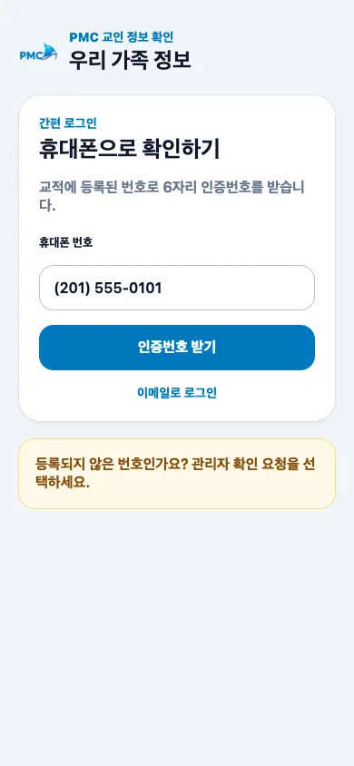

# 회원 로그인

## 목적

교적에 등록된 휴대폰 또는 이메일로 본인 확인 후 가족 정보에 들어갑니다.

## 사전 조건

- 교적에 등록된 휴대폰이나 이메일을 사용할 수 있어야 합니다.
- SMS/이메일의 6자리 인증번호는 다른 사람에게 알려주지 마세요.

## 작업 단계

1. 로그인 화면에서 휴대폰 번호를 입력하고 **인증번호 받기**를 선택합니다.
2. 이메일을 쓰려면 **이메일로 로그인**을 선택하고 등록 이메일을 입력합니다.
3. 받은 6자리 번호를 만료 전에 입력합니다. 성공하면 가족 화면으로 이동합니다.

<figure class="mobile-shot">
  
  <figcaption>1–2단계: SMS와 이메일 로그인 방식을 선택하는 화면</figcaption>
</figure>

## 성공 결과

**우리 가족 정보** 제목과 가족 구성원이 표시됩니다.

## 흔한 오류와 해결

- **등록되지 않은 번호**: 번호를 다시 확인하고, 계속되면 관리자 확인 요청을 시작합니다.
- **인증번호 만료/불일치**: 새 번호를 한 번만 요청하고 가장 최근 번호를 입력합니다.
- **문자가 오지 않음**: 국가번호, 차단 메시지함, 통신 상태를 확인하거나 이메일 로그인을 사용합니다.
