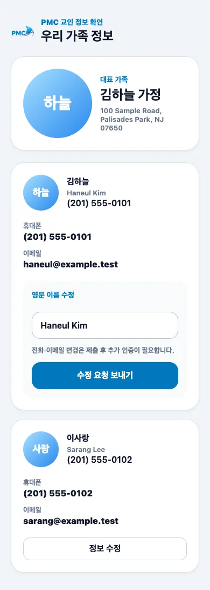

# 사진 요청

## 목적

개인 사진 또는 가족 사진을 선택하고 필요한 부분을 잘라 변경 요청을 보냅니다.

## 사전 조건

- 얼굴이 잘 보이는 JPG, PNG, HEIC 이미지를 준비합니다.
- 사진에 포함된 가족의 동의를 받습니다.

## 작업 단계

1. 개인 또는 가족 사진 카드에서 **사진 변경 요청**을 선택합니다.
2. 사진을 선택하고 미리보기에서 확대·이동해 자를 영역을 맞춥니다.
3. **이 사진 사용** 후 미리보기를 확인하고 요청을 제출합니다.
4. 잘못된 사진이면 기존 대기 요청을 취소한 뒤 새 사진으로 다시 요청합니다.

<figure class="mobile-shot">
  
  <figcaption>1단계: 수정할 구성원 카드에서 사진 변경을 시작합니다.</figcaption>
</figure>

## 성공 결과

요청 내역에 **개인 사진** 또는 **가족 사진** 항목과 미리보기가 표시됩니다.

## 흔한 오류와 해결

- **파일을 읽을 수 없음**: 이미지를 JPG/PNG로 변환하거나 더 작은 파일을 사용합니다.
- **얼굴이 잘림**: 제출 전 자르기 화면에서 얼굴 주변 여백을 남깁니다.
- **재요청이 안 됨**: 동일 대상의 기존 대기 요청을 먼저 취소합니다.
