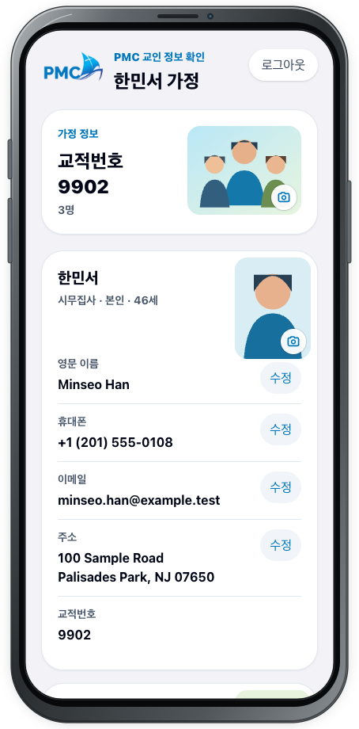
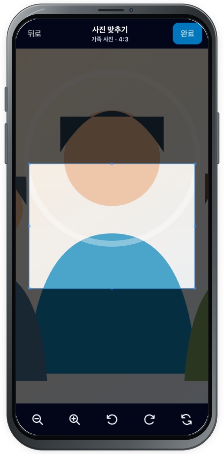
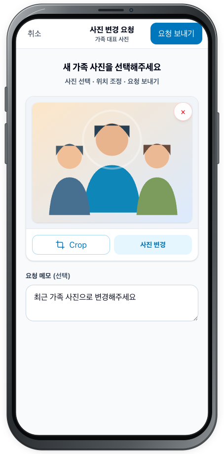
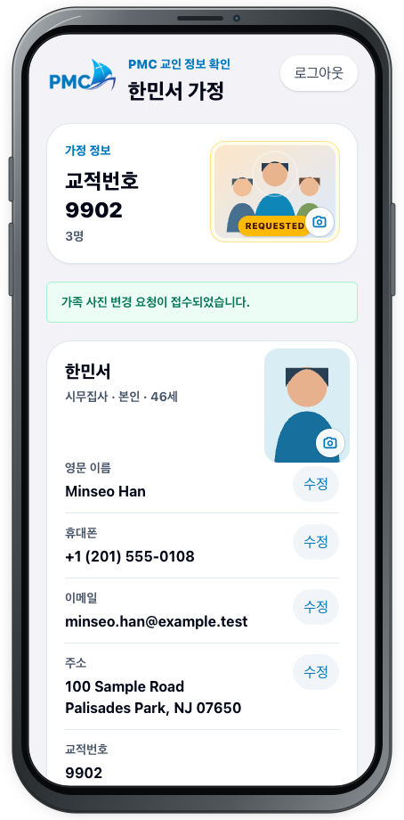

# 사진 요청

## 목적

가족 대표 사진을 선택하고 4:3 영역에 맞춘 뒤 선택 메모와 함께 변경 요청을 보냅니다.

## 사전 조건

- [가족 정보](family.md)에 로그인되어 있어야 합니다.
- JPG, PNG, WebP, HEIC 또는 HEIF 가족 사진을 준비하고, 사진에 나온 가족의 동의를 받습니다.

## 작업 단계

1. **가정 정보** 카드의 가족 사진에서 카메라 버튼(**가족 사진 변경 요청**)을 선택합니다.

2. **사진 변경 요청** 화면에서 **사진 선택**을 선택하고 기기에서 사진을 고릅니다.
3. **사진 맞추기** 화면에서 사진을 이동하고 **축소**, **확대**, **왼쪽으로 회전**, **오른쪽으로 회전**, **초기화** 도구로 4:3 영역을 맞춘 뒤 **완료**를 선택합니다.

4. 선택한 사진 미리보기를 확인합니다. 다시 맞추려면 **Crop**, 다른 사진을 고르려면 **사진 변경**을 선택합니다.
5. 필요한 경우 **요청 메모 (선택)**에 관리자에게 전달할 내용을 입력하고 **요청 보내기**를 선택합니다.

6. **가족 사진 변경 요청이 접수되었습니다.** 안내와 사진의 `Requested` 표시를 확인합니다.

구성원 사진도 해당 구성원의 카메라 버튼에서 시작하며, 사진 선택과 **사진 맞추기** 과정은 같습니다. 구성원 사진은 `프로필 사진 · 3:4` 영역을 사용합니다.

<figure class="device-shot">
  
  <figcaption>가족 대표 사진의 카메라 버튼을 선택해 요청을 시작합니다.</figcaption>
</figure>
<figure class="device-shot">
  
  <figcaption><strong>사진 맞추기</strong>에서 4:3 영역을 조정하고 <strong>완료</strong>를 선택합니다.</figcaption>
</figure>
<figure class="device-shot">
  
  <figcaption>미리보기와 선택 메모를 확인하고 <strong>요청 보내기</strong>를 선택합니다.</figcaption>
</figure>
<figure class="device-shot">
  
  <figcaption>접수 안내와 가족 사진의 <strong>Requested</strong> 표시를 확인합니다.</figcaption>
</figure>

## 성공 결과

가족 사진 변경 요청이 접수되고 새 미리보기에 `Requested`가 표시됩니다. 현재 교적 사진은 관리자가 요청을 처리한 뒤 바뀝니다.

## 다음 단계

[요청 관리](requests.md)에서 **가족 사진** 요청의 번호와 상태를 확인합니다. 파일 선택, 업로드, 취소 또는 재요청 문제는 [문제 해결](../troubleshooting.md)을 확인하세요.
