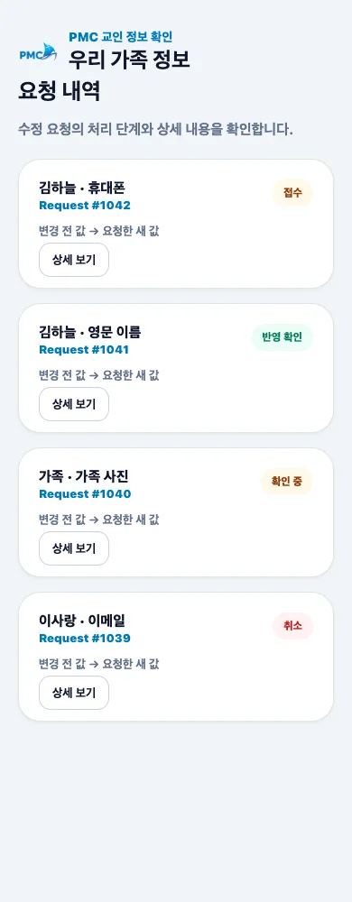

# 요청 관리

## 목적

요청 상태와 상세 workflow를 확인하고, 허용된 요청을 취소하거나 취소 기록을 삭제합니다.

## 사전 조건

- 로그인 후 **요청 내역**을 엽니다.

## 작업 단계

1. 항목명, 요청 번호, 담당 역할과 상태를 확인합니다.
2. **상세 보기**에서 변경 전·후 값, 메모, 전화·이메일 인증 상태를 봅니다.
3. 아직 **접수**인 요청은 **요청 취소**로 철회할 수 있습니다.
4. **취소**된 기록은 **기록 삭제**로 내 화면에서 제거할 수 있습니다.
5. 공용 기기에서는 확인 후 반드시 **로그아웃**합니다.

<figure class="mobile-shot">
  
  <figcaption>1–4단계: 상태, 상세, 취소 동작을 확인하는 요청 내역</figcaption>
</figure>

## 성공 결과

처리 중 요청은 최신 상태로 보이고, 취소·삭제 동작은 새로 고침 후에도 유지됩니다.

## 흔한 오류와 해결

- **취소 버튼 없음**: 관리자가 이미 처리를 시작했을 수 있습니다. 상세 메모를 확인하세요.
- **상태가 오래 바뀌지 않음**: 요청 번호를 포함해 지원팀에 문의합니다.
