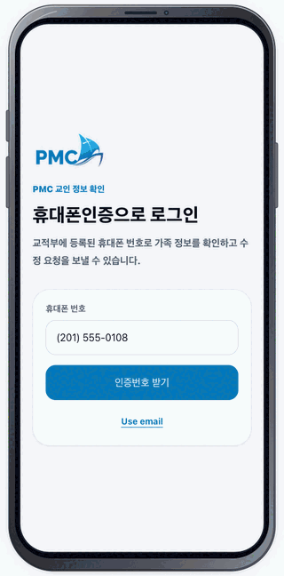

# 빠른 시작

회원의 기본 흐름은 **로그인 → 가족 확인 → 인증된 수정 요청 → 사진 요청 → 요청 상태 확인**입니다. 아래 GIF가 실제 화면을 순서대로 반복 재생합니다.

<figure class="workflow-animation">
  
  <figcaption>회원 5단계 화면 흐름 · 자동 반복 재생</figcaption>
</figure>

## 회원 5단계

1. 휴대폰 번호를 입력하고 **인증번호 받기**를 선택한 뒤 SMS의 6자리 번호로 로그인합니다.
2. 가족 요약과 각 구성원의 연락처·사진을 확인합니다.
3. 수정할 항목의 **수정**을 선택하고, 휴대폰 변경은 **지금 인증**으로 완료합니다.
4. 가족 사진의 카메라 버튼에서 사진을 선택하고 **사진 맞추기** 후 요청을 보냅니다.
5. **요청 내역**에서 `Request #`, 담당 역할, `Verified`와 처리 상태를 확인합니다.

자세히: [회원 로그인](member/login.md) · [가족 정보](member/family.md) · [정보 수정 및 인증](member/edit.md) · [사진 요청](member/photos.md) · [요청 관리](member/requests.md)

## 직원

1. `/admin/login`에서 승인된 Google 계정으로 로그인합니다.
2. 역할에 허용된 메뉴를 엽니다.
3. 요청 상세와 교적 정보를 대조한 후 처리합니다.

다음: [기능 개요](features.md) · [역할별 접근 권한](access.md)
